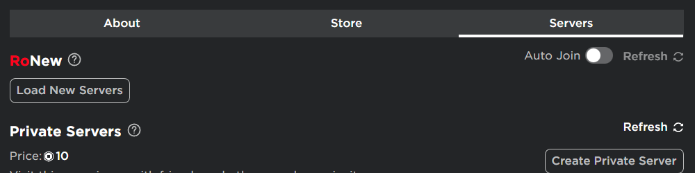
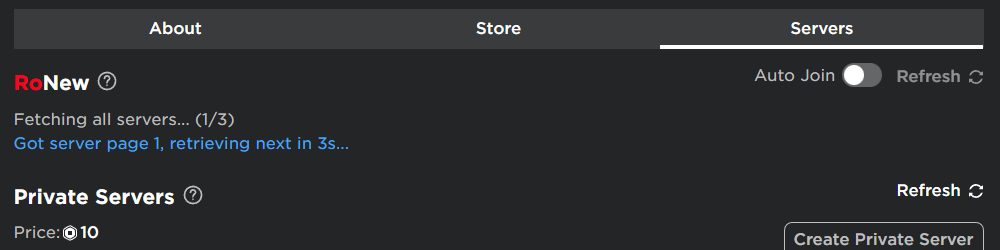
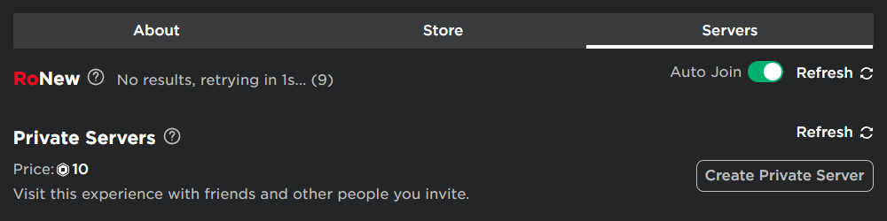
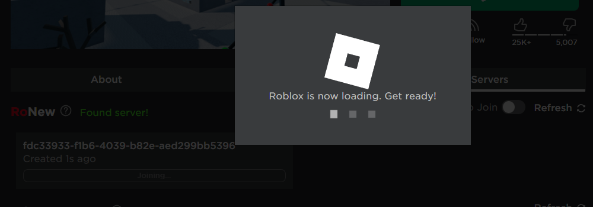
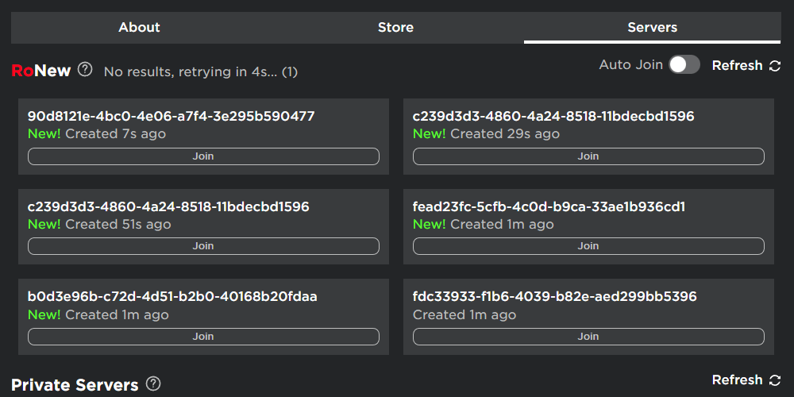

    </img>
    </img>
    

In a single click, join the newest server of any Roblox experience!

---

This extension allows you to automatically join the newest server of a Roblox experience, by waiting for the new server to show up.

# Features

-   Get newest Roblox servers for any game
-   Seamless integration
-   Auto Join
-   Refresh

Screenshots

 

# Installation

## Manually

1. Download this repo (Code > Download ZIP)
2. Go to your [chrome extensions page](chrome://extensions)
3. Enable developer mode
4. Click `Load unpacked`
5. Select the `src` folder from the extracted zip
6. Confirm

# Usage

1. Navigate to a roblox game page ([try this one](https://www.roblox.com/games/1689414409))
2. Go to the `Servers` tab
3. You should see a `RoNew` section
4. Click `Load New Servers`
5. Enjoy!

Note that it may take a while on certain games, as Roblox can stop creating new servers periodically.

# License

See [LICENSE.md](LICENSE.md)
