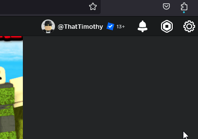

    </img>
    </img>
    

In a single click, join the newest server of any Roblox experience!

---

This extension allows you to automatically join the newest server of a Roblox experience, by waiting for the newest server to show up.

# Features

-   Get newest Roblox servers for any game
-   Seamless integration
-   Auto Join
-   Refresh

Screenshots

 

# Installation

## Through the Chrome Web Store

Simply click the button below, and then click `Add to Chrome`

## Through Firefox Add-ons

Simply click the button below, and then click `Add to Firefox`

## Manually / For Development

Expand

**This option should only be used if the above option will not work / an update has not been approved on the webstore yet**. Only do the following if you know what you are doing.

Chrome Instructions

1. Download this repo (Code > Download ZIP)
2. Extract the zip, drag the `manifests/chrome.json` file into the `src` folder
3. Rename `chrome.json` to `manifest.json`
4. Go to your [chrome extensions page](chrome://extensions)
5. At the top right, turn on developer mode
6. Click `Load unpacked`
7. Select the `src` folder from the extracted zip
8. Confirm

Firefox Instructions

1. Download this repo (Code > Download ZIP)
2. Extract the zip, drag the `manifests/firefox.json` file into the `src` folder
3. Rename `firefox.json` to `manifest.json`
4. Go to your [firefox addons page](about:debugging#/runtime/this-firefox)
5. Click `Load Temporary Add-on...`
6. Select the `manifest.json` file from the `src` folder from the extracted zip
7. Confirm

# Usage

1. Navigate to a roblox game page ([try this one](https://www.roblox.com/games/1689414409))
2. 

   

   If on Firefox, allow permissions (click to expand)
   

    

    `Extensions` -> `RoNew Settings` -> `Always allow on roblox.com`

       

3. Go to the `Servers` tab
4. You should see a `RoNew` section
5. Click `Load New Servers`
6. Enjoy!

Note that it may take a while on certain games, as Roblox can stop creating new servers periodically.

# Issues

If you encounter any issues, please open an issue:

Please include as much detail as possible, such as what you did to get the issue to occur, and what the actual issue is.

# License

See [LICENSE.md](LICENSE.md)
